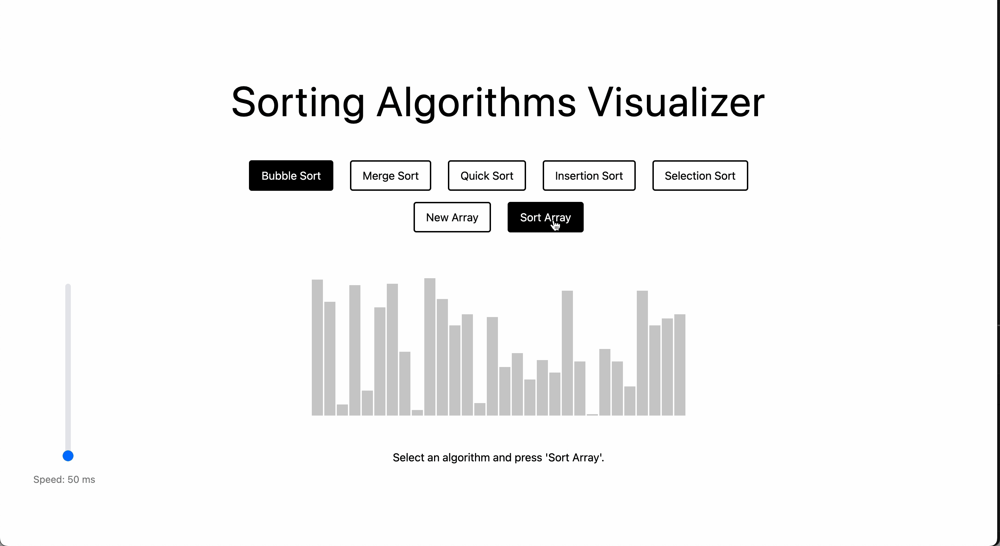
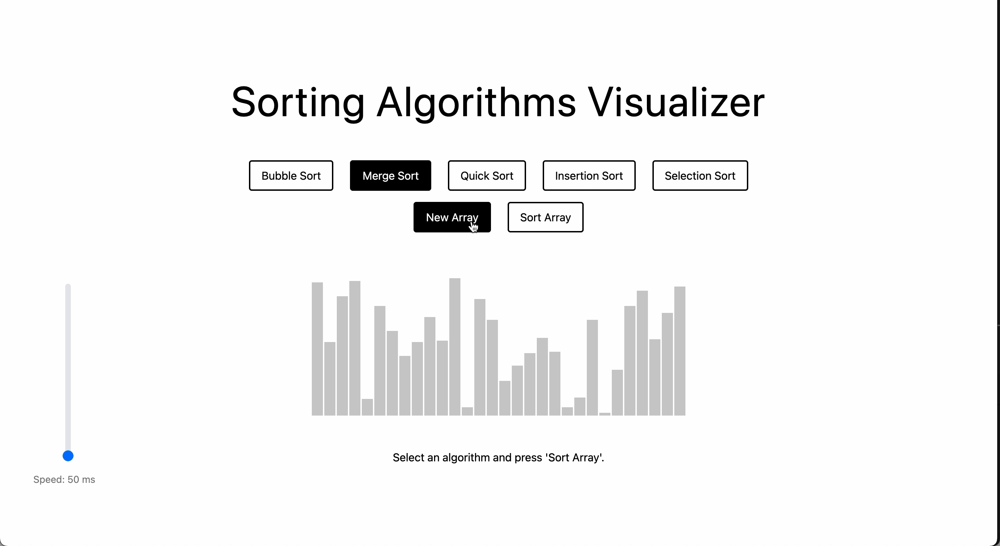
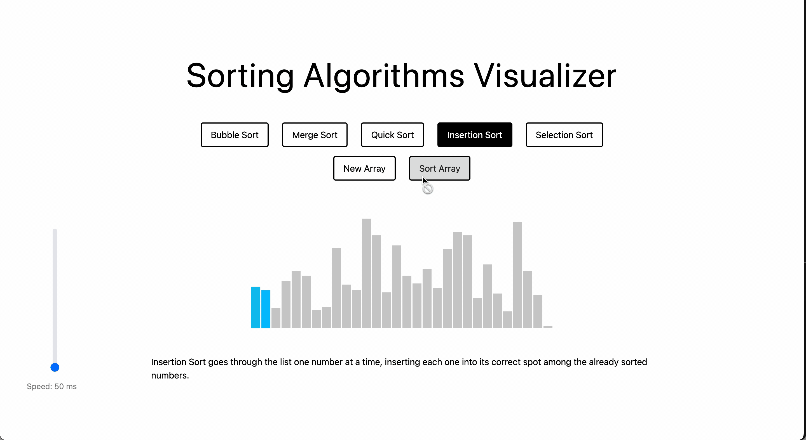
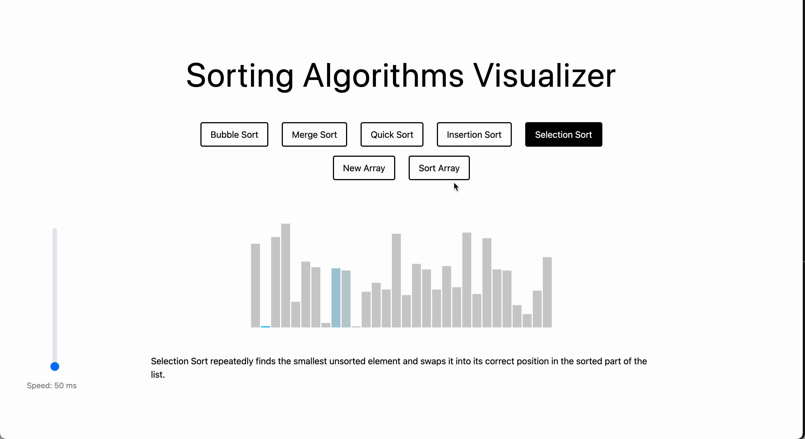

#### Sorting Algorithm Visualizer

This web app lets you see how different sorting algorithms work through interactive visualizations. It supports a variety of sorting algorithms, including Bubble Sort, Merge Sort, Quick Sort, Insertion Sort, and Selection Sort.

#### Installation

```bash
git clone https://github.com/samanthacabrera/sorting-visualizer
cd mediapipe-hand-tracker
npm install
npm run dev
```

The app will be available at http://localhost:5173.
</br>

**Understanding the Algorithms**

Sorting algorithms are ways to arrange data in a specific order—usually ascending or descending. Each algorithm works differently and has its own strengths and weaknesses. This project includes five popular algorithms:

1. **Bubble Sort** compares pairs of nums and swaps if needed, until largest 'bubbles' to end.



2. **Merge Sort** divides the list into smaller sublists until each contains one element, then 'merges' the sublists in sorted order.



3. **Quick Sort** selects a pivot, separates smaller and bigger numbers around it, then sorts each part.


4. **Insertion Sort** goes through the list one number at a time, inserting each one into its correct spot among the already sorted numbers.



5. **Selection Sort** repeatedly finds the smallest unsorted element and swaps it into its correct position in the sorted part of the list.



</br>

Once you understand how each algorithm works, the next step is learning how to compare them. To do that, we look at Time and Space Complexity, which help us measure how efficient each algorithm is when handling different tasks.

**What is Time and Space Complexity?**

- Time Complexity describes how the time to complete the algorithm grows as the size of the input grows.
- Space Complexity describes how much extra memory the algorithm needs as it runs.

These two measurements help us figure out which algorithm is best suited for a particular situation. Big O provides a standardized way to measure and compare the efficiency of different algorithms.

**What is Big O Notation?**

Big O is a mathematical way to describe how an algorithm’s time or space needs grow as the input grows.

- O(1) means the algorithm takes the same time no matter how big the input is (constant time).

- O(n) means the time grows directly with the input size.

- O(n²) means the time grows a lot faster as input grows (quadratic time).

- O(log n) or O(n log n) is more efficient, especially for large inputs.

</br>

**Algorithm Performance Comparison**

| Algorithm          | Best Time Complexity | Average Time Complexity | Worst Case Time Complexity | Space Complexity |
| ------------------ | -------------------- | ----------------------- | -------------------------- | ---------------- |
| **Bubble Sort**    | O(n)                 | O(n²)                   | O(n²)                      | O(1)             |
| **Merge Sort**     | O(n log n)           | O(n log n)              | O(n log n)                 | O(n)             |
| **Quick Sort**     | O(n log n)           | O(n log n)              | O(n²)                      | O(log n)         |
| **Insertion Sort** | O(n)                 | O(n²)                   | O(n²)                      | O(1)             |
| **Selection Sort** | O(n²)                | O(n²)                   | O(n²)                      | O(1)             |

</details>
