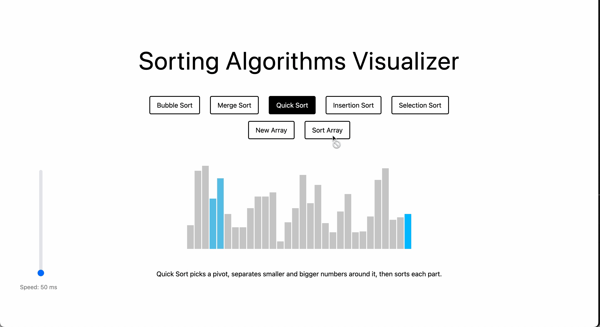

### Sorting Algorithm Visualizer

This web app lets you see how different sorting algorithms work through interactive visualizations. It supports a variety of sorting algorithms, including Bubble Sort, Merge Sort, Quick Sort, Insertion Sort, and Selection Sort.

### Installation

```bash
git clone https://github.com/samanthacabrera/sorting-visualizer
cd sorting-visualizer
npm install
npm run dev
```

The app will be available at http://localhost:5173.

</br>

### Understanding the Algorithms

Sorting algorithms are ways to arrange data in a specific order—usually ascending or descending. Each algorithm works differently and has its own strengths and weaknesses. This project includes five popular algorithms:

</br>

**Bubble Sort** compares pairs of nums and swaps if needed, until largest 'bubbles' to end.

</br>


</br>

**Merge Sort** divides the list into smaller sublists until each contains one element, then 'merges' the sublists in sorted order.

</br>


</br>

**Quick Sort** selects a pivot, separates smaller and bigger numbers around it, then sorts each part.

</br>



</br>

**Insertion Sort** goes through the list one number at a time, inserting each one into its correct spot among the already sorted numbers.

</br>


</br>

**Selection Sort** repeatedly finds the smallest unsorted element and swaps it into its correct position in the sorted part of the list.

</br>


</br>

Once you understand how each algorithm works, the next step is learning how to compare them. To do that, we look at Time and Space Complexity. 

**What is Time and Space Complexity?**

- **Time Complexity** describes how the time to complete the algorithm grows as the size of the input grows.
- **Space Complexity** describes how much extra memory the algorithm needs as it runs.

These two measurements help us figure out which algorithm is best suited for a particular situation. Big O provides a standardized way to measure and compare the efficiency of different algorithms.

**What is Big O Notation?**

Big O is a mathematical way to describe how an algorithm’s time or space needs grow as the input grows.

- **O(1)** or constant time means the algorithm takes the same time no matter how big the input is. 

- **O(n)** or linear time means the time the algorithm takes grows directly with the size of the input.

- **O(n²)** or quadratic time means the time the algorithm takes grows much faster than the size of the input. 

- **O(log n)** or logarithmic time means the time the algorithm takes increases slowly even as the input gets much larger.

- **O(n log n)** or linearithmic time means the time the algorithm takes grows faster than linear time but slower than quadratic time. 
  
</br>

**Algorithm Performance Comparison**

| Algorithm          | Best Time Complexity | Average Time Complexity | Worst Case Time Complexity | Space Complexity |
| ------------------ | -------------------- | ----------------------- | -------------------------- | ---------------- |
| **Bubble Sort**    | O(n)                 | O(n²)                   | O(n²)                      | O(1)             |
| **Merge Sort**     | O(n log n)           | O(n log n)              | O(n log n)                 | O(n)             |
| **Quick Sort**     | O(n log n)           | O(n log n)              | O(n²)                      | O(log n)         |
| **Insertion Sort** | O(n)                 | O(n²)                   | O(n²)                      | O(1)             |
| **Selection Sort** | O(n²)                | O(n²)                   | O(n²)                      | O(1)             |

</details>
